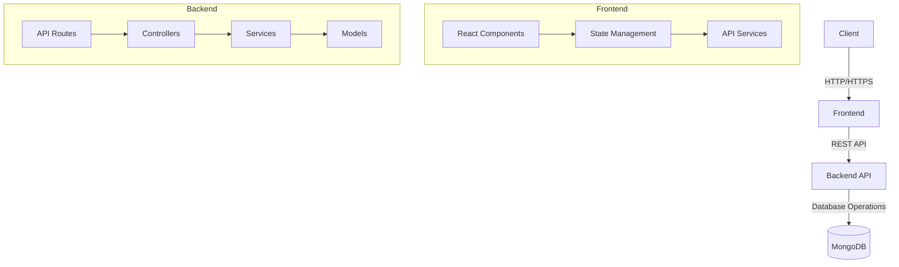

# Enquiry Management System

A full-stack application built with React + Vite (Frontend) and Node.js + Express + MongoDB (Backend) for managing customer enquiries with role-based access control.

## 🚀 Features

- **User Authentication**
  - Register, Login, and Profile management
  - JWT-based authentication
  - Role-based access control (Admin/Staff/User)

- **Enquiry Management**
  - Create, Read, Update, Delete enquiries
  - Filter and search functionality
  - Status tracking (New, In Progress, Closed)

- **User Management** (Admin Only)
  - View all users
  - Create/Edit/Delete users
  - Assign enquiries to staff

- **API Documentation**
  - Available at Postman Collection for API Understanding

## 🛠 Tech Stack

**Frontend:**

- React 18 + TypeScript
- Vite
- Tailwind CSS
- React Router DOM
- React Hook Form
- React Query
- Axios

**Backend:**

- Node.js + Express
- TypeScript
- MongoDB + Mongoose
- JWT Authentication
- Zod for validation
- Swagger for API documentation

## 📦 Prerequisites

- Node.js (v18+)
- npm or yarn
- MongoDB (local or Atlas)
- Git

## 🚀 Getting Started

### 1. Clone the repository

```bash
git clone https://github.com/sanskardudhe09/EnquiryManagement_MERN.git
cd EnquiryManagement_MERN
```

### 2. Backend Setup

```bash
# Navigate to backend directory
cd backend

# Install dependencies
npm install

# Create .env file
cp .env.example .env

# Update .env with your configuration
# MONGODB_URI=your_mongodb_uri
# JWT_SECRET=your_jwt_secret
# NODE_ENV=development

# Run in development
npm run dev

# Build for production
npm run build
npm start
```

### 3. Frontend Setup

```bash
# Navigate to frontend directory
cd ../frontend

# Install dependencies
npm install

# Create .env file
cp .env.example .env

# Update VITE_API_URL to point to your backend
# VITE_API_URL=http://localhost:5000/api

# Start development server
npm run dev
```

## 🔧 Environment Variables

### Backend (`.env`)

```env
PORT=5000
MONGODB_URI=mongodb://localhost:27017/enquiry_management
JWT_SECRET=your_jwt_secret_here
NODE_ENV=development
```

### Frontend (`.env`)

```env
VITE_API_URL=http://localhost:5000/api
```

## 👨‍💻 Developer Guide

### Running the Application

#### Development Mode

1. **Start Backend**

   ```bash
   cd backend
   npm install
   npm run dev
   ```

2. **Start Frontend** (in a new terminal)

   ```bash
   cd frontend
   npm install
   npm run dev
   ```

3. Access the application at `http://localhost:5173`

#### Production Build

1. **Build Frontend**

   ```bash
   cd frontend
   npm run build
   ```

2. **Start Backend in Production**
   ```bash
   cd backend
   npm run build
   npm start
   ```

## 🧪 Testing

### Backend Tests

#### Unit Tests

```bash
cd backend
npm run test:unit
```

#### Integration Tests

```bash
cd backend
npm run test:integration
```

#### All Tests (Unit + Integration)

```bash
cd backend
npm test
```

### Frontend Tests

#### Unit Tests

```bash
cd frontend
npm run test:unit
```

#### Component Tests

```bash
cd frontend
npm run test:component
```

#### All Tests

```bash
cd frontend
npm test
```

#### Test Coverage

```bash
# For backend
cd backend && npm run test:coverage

# For frontend
cd frontend && npm run test:coverage
```

## 🏗️ System Architecture



_Note: The system follows a layered architecture with clear separation of concerns between presentation (Frontend), business logic (Backend), and data storage (MongoDB)._

## 🚀 Deployment

## 📚 API Documentation

The API documentation is available at:

- **Postman Collection Link:** `https://www.postman.com/sanskar9/workspace/sanskar-s-public-workspace/collection/21942128-e94729e6-088e-466d-a45a-a832cedd0215?action=share&creator=21942128`

## 🚀 Deployment

### Backend (Render/Heroku)

1. Push your code to the repository
2. Connect to your deployment platform
3. Set environment variables
4. Deploy!

### Frontend (Vercel/Netlify)

1. Connect your repository
2. Set environment variables
3. Set build command: `npm run build`
4. Set output directory: `dist`
5. Deploy!

## 📝 Project Structure

```
enquiry-management-system/
├── backend/                 # Backend code
│   ├── src/
│   │   ├── config/         # Configuration files
│   │   ├── controllers/    # Route controllers
│   │   ├── middlewares/    # Custom middlewares
│   │   ├── models/         # Database models
│   │   ├── routes/         # API routes
│   │   ├── utils/          # Utility functions
│   │   ├── app.ts          # Express app setup
│   │   └── index.ts        # Server entry point
│   └── package.json
│
├── frontend/               # Frontend code
│   ├── public/             # Static files
│   ├── src/
│   │   ├── components/     # Reusable components
│   │   ├── pages/          # Page components
│   │   ├── hooks/          # Custom hooks
│   │   ├── services/       # API services
│   │   ├── styles/         # Global styles
│   │   ├── types/          # TypeScript types
│   │   ├── utils/          # Utility functions
│   │   ├── App.tsx         # Main App component
│   │   └── main.tsx        # Entry point
│   └── package.json
│
└── README.md
```

## 🤝 Contributing

1. Fork the repository
2. Create your feature branch (`git checkout -b feature/amazing-feature`)
3. Commit your changes (`git commit -m 'Add some amazing feature'`)
4. Push to the branch (`git push origin feature/amazing-feature`)
5. Open a Pull Request

## 📄 License

This project is licensed under the MIT License - see the [LICENSE](LICENSE) file for details.

## 🙏 Acknowledgments

- [React](https://reactjs.org/)
- [Vite](https://vitejs.dev/)
- [Express](https://expressjs.com/)
- [MongoDB](https://www.mongodb.com/)
- [Tailwind CSS](https://tailwindcss.com/)
